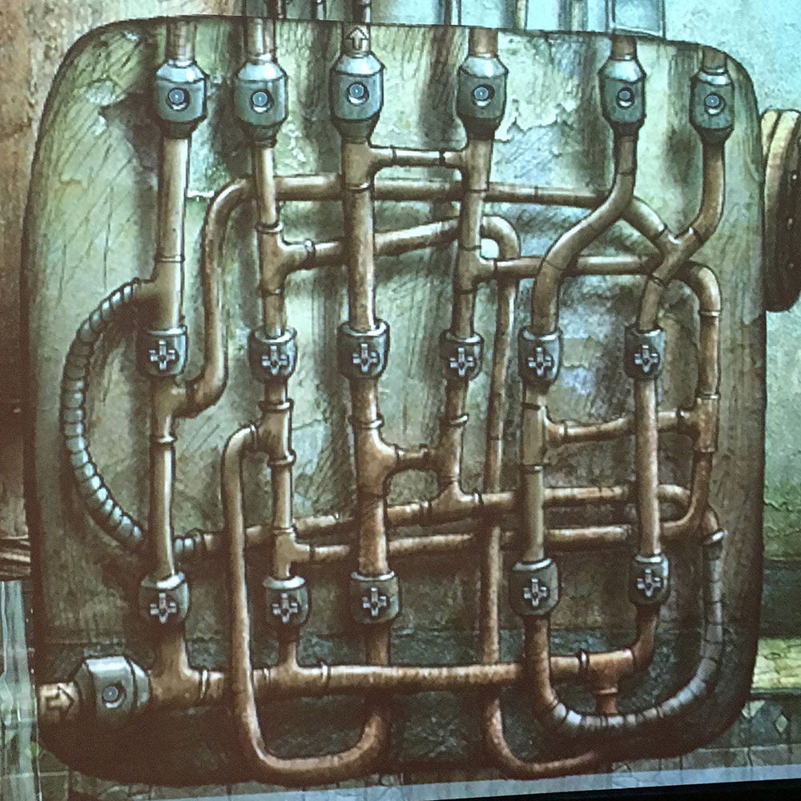
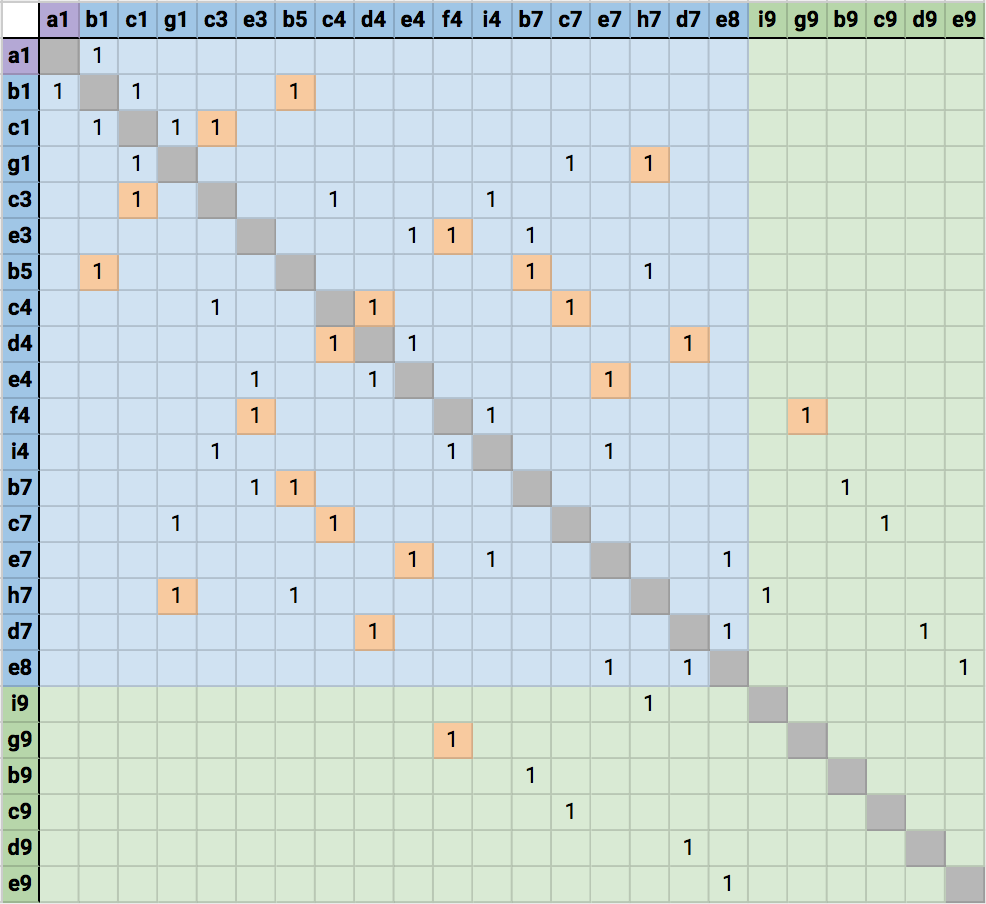

### Machinarium Plumbing Simulator

This is an interactive simulation of [this demonic Machinarium puzzle](http://machinarium.wikia.com/wiki/Plumbing_Puzzle). It is just accurate enough to have mostly led us to the correct solution. Jesus, what a nightmare.

### Usage

Visit https://raws.github.io/machinarium-plumbing-sim. Click the orange valves to toggle them on and off. Observe how the magic liquid flows through the valves when they are turned on, but doesn't flow through them when they are turned off. Keep toggling valves until the <code>OD9</code> node doesn't have any inflow. Then you've won!

### The less visual approach
If you still think pressing those buttons is too much work, we have also created an algorithmic approach that tries out wrench combinations for you!

#### The problem
We are presented with the following image:

The arrow in the bottom left corner indicates the incoming flow, and the arrow in the third pipe along the top indicates the exit pipe whose flow we must cut off. The `+` marks indicate an attachment point for a wrench, which would cut off the flow of water through that segment of the pipe. We have 3 wrenches that we must attach in some combination to these attachment points in order to completely cut off the flow through the indicated top pipe.

The first step to solving the problem programatically, of course, is to assign labels! Observe our wonderful grid system.

The blue nodes represent junctions of 3 pipe segments, green nodes are output nodes that each connect to only one other node, and there is one source node, colored purple. The orange labels indicate a pipe segment that can be switched off by a wrench.

We can now use these labels to model our plumbing system as a graph, where a pipe segment is represented as an edge between two nodes.

A common way to represent graphs is with an adjacency matrix. Two nodes are *adjacent* if they are connected by an edge; in other words, if they are direct neighbors of one another. Each element in the matrix represents a pair of nodes; if the two nodes are adjacent, then the element is 1. Otherwise it is 0 or empty.

Here is our adjacency matrix, with the same color coding as in the grid:

So with this graphical representation of our pipe system, we can rephrase the problem. Given what we know about the flow of water through pipes, if there exists a path between the source of the water and the target pipe, then water will be able to flow through the target pipe. Therefore, solving the problem comes down to finding out which three edges must be "wrenched" (i.e. deleted) in order to disconnect the source node `a1` from the target node `d9`.

In other words, our solution is the set of three wrench edges that, when deleted, result in the absence of `d9` from `a1`'s component.

The [python script](./find_wrenches.py) cycles through all possible combinations of three edges until the previous condition is met. 

### License

Released by [Ross Paffett](https://github.com/raws) and [Elena Palesis](https://github.com/elenapalesis) under the terms of the Do What the Fuck You Want to Public License (WTFPL).
